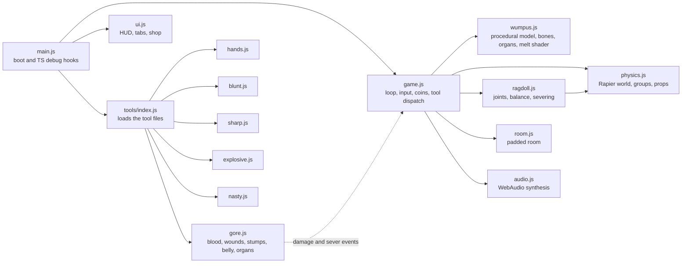

<p align="center">
  
</p>

<p align="center">
  <a href="https://winchxyz.github.io/wumpus-torture-simulator/"></a>
  
  
  
  <a href="LICENSE"></a>
  <a href="https://github.com/winchxyz/wumpus-torture-simulator/stargazers"></a>
</p>

<h2 align="center">
  <a href="https://winchxyz.github.io/wumpus-torture-simulator/">▶ Play it now</a>
</h2>

<p align="center"><sub>Runs in any modern browser, desktop or phone. No install, no sign-up.</sub></p>

<p align="center">
  
  <br>
  <sub>A 6 second loop of the real game. <a href="media/hero.mp4">Sharper MP4 version</a>.</sub>
</p>

---

## 🎬 What is this?

**Wumpus Torture Simulator** is a Kick-the-Buddy-style physics sandbox in 3D. A wobbly, big-eared ragdoll called Wumpus stands in a padded room, and you get a toolbar of hands, blunt objects, blades, explosives and chemicals to try on him. Every hit pays coins, and coins unlock the tools you cannot afford yet. The gore is stylized cartoon (glossy toon-red blood, white cartoon bones, pink flesh) and there is a switch to turn it off. He never really dies: one click on Reset and he is standing again. Once things go calm for a couple of seconds his face turns teary and he gives you a trembling thumbs-up.

Everything is generated in code. There are no image, model or sound files in the repo.

## ✨ Features

| | |
|---|---|
| 🧍 **Ragdoll physics** | Nine rigid bodies on [Rapier](https://rapier.rs/) joints, stepped at a fixed 120 Hz. A balance controller keeps him upright and wobbling, he goes limp after big hits, and he can lose his head, arms and legs for real. |
| 🧰 **25 tools** | Hands, blunt, sharp, explosive and nasty, each with its own wind-up, follow-through, sound and gore. See the [tool list](#-tools). |
| 🩸 **Gore toggle** | One button swaps blood and guts for stars and sweat drops. Same physics, same fun, no blood. |
| 🫀 **Organs you can squeeze** | Open his belly and 19 organ props tumble out with a floppy rope of intestines. Grab them, squeeze them, pop them. |
| ☣️ **Acid melt shader** | Skin droops, bubbles and dissolves down to the skull, drip by drip, all in a custom shader patched into the toon materials. |
| 🪙 **Coins and shop** | Damage pays coins, floating "+N" text pops up, and locked tools glow when you can afford them. Your balance is saved in the browser. |
| 🎨 **Procedural everything** | The model, room, tools, decals, particles and even the sound effects are built at runtime. Sound is pure WebAudio synthesis. |
| 📱 **Phone support** | Pointer-event input with forgiving finger picking, and a HUD that reflows below 720 px wide. |

## 🧰 Tools

25 tools in five tabs. Eight are free from the start (all the Hands, the Mallet and the Knife), the other 17 are bought with coins. Prices below are straight from the code.

<p align="center">
  
</p>

### ✋ Hands

| Icon | Tool | What it does | Price |
|:-:|---|---|--:|
| ✊ | **Grab & Throw** | Drag any body part, swing him around, let go. | Free |
| ✋ | **Slap** | An open-handed smack that leaves a handprint. | Free |
| 👉 | **Poke** | Prod him and watch him squish. | Free |
| 🪶 | **Tickle Feather** | Rub the feather over him until he giggles. | Free |
| 👂 | **Ear Pull** | Stretch an ear as far as it goes, then let go. | Free |
| 🌱 | **Pluck Leaf** | Yank the sprout off his head. It grows back. | Free |

### 🔨 Blunt

| Icon | Tool | What it does | Price |
|:-:|---|---|--:|
| 🔨 | **Mallet** | A big wind-up and a WHAM that pancakes him flat. | Free |
| 🐔 | **Rubber Chicken** | A squeaky, dangling, deeply humiliating whack. | 🪙 40 |
| 🍳 | **Frying Pan** | BONG. Shockwave rings included. | 🪙 60 |
| 🎳 | **Bowling Ball** | Drops from above onto the spot you click, then rolls on. | 🪙 120 |
| 🥊 | **Boxing Glove** | A spring-loaded punch that launches him across the room. | 🪙 200 |
| ⚒️ | **Anvil** | A shadow grows on the floor, then it lands. Cracks the tiles. | 🪙 250 |
| 🎹 | **Piano** | Same idea, but it smashes into flying debris. | 🪙 350 |

### 🔪 Sharp

| Icon | Tool | What it does | Price |
|:-:|---|---|--:|
| 🔪 | **Knife** | Stab him and the blade stays in. Click a stuck knife to pull it out. | Free |
| 🎯 | **Throwing knives** | Flick them at him or the walls. Most stick, a few bounce off flat. | 🪙 90 |
| ⚔️ | **Cutter** | A curved sabre. A fast stroke through a joint cuts off a limb, or his head. | 🪙 180 |
| 🪓 | **Cleaver** | A heavy chop with a proper wind-up. It stays wedged in. | 🪙 260 |
| ⛓️ | **Chainsaw** | Hold to rev it up, then saw through whatever is under it. | 🪙 400 |

### 💥 Boom

| Icon | Tool | What it does | Price |
|:-:|---|---|--:|
| 💣 | **Bomb** | Sets a lit fuse, then a full cartoon fireball with a radial blast. | 🪙 100 |
| 🍍 | **Grenade** | Tossed, bounces around, then goes off. | 🪙 200 |
| 🥏 | **Landmine** | Plant it and set it off with something heavy. Launches whatever is on top. | 🪙 300 |
| 🧨 | **Dynamite** | Sticks to him with a burning fuse. | 🪙 500 |

### ☣️ Nasty

| Icon | Tool | What it does | Price |
|:-:|---|---|--:|
| ☣️ | **Acid** | Pour a flask on him. The skin sags, bubbles and dissolves, and long pours drop limbs. | 🪙 120 |
| 🤏 | **Squeeze** | A giant glove that flattens limbs, bursts his torso and pops loose organs. | 🪙 180 |
| 🪚 | **Saw** | A hand saw. Work it back and forth across his belly to open him up. | 🪙 260 |

## 🖼️ Gallery

<table align="center">
  <tr>
    <td align="center"><a href="media/shot-hands.png"></a><br><sub>✊ Throw him</sub></td>
    <td align="center"><a href="media/shot-blunt.png"></a><br><sub>🍳 Frying pan</sub></td>
    <td align="center"><a href="media/shot-piano.png"></a><br><sub>🎹 Piano</sub></td>
  </tr>
  <tr>
    <td align="center"><a href="media/shot-bomb.png"></a><br><sub>💣 Bomb</sub></td>
    <td align="center"><a href="media/shot-knives.png"></a><br><sub>🎯 Knives stuck</sub></td>
    <td align="center"><a href="media/shot-cleaver.png"></a><br><sub>🪓 Cleaver</sub></td>
  </tr>
  <tr>
    <td align="center"><a href="media/shot-chainsaw.png"></a><br><sub>⛓️ Chainsaw</sub></td>
    <td align="center"><a href="media/shot-acid.png"></a><br><sub>☣️ Acid</sub></td>
    <td align="center"><a href="media/shot-organs.png"></a><br><sub>🤏 Organs and squeeze</sub></td>
  </tr>
</table>

<p align="center"><sub>All shots are straight from the game, HUD included. Click one for the full 1280 x 720 image.</sub></p>

## 🎮 How to play

| Do this | To get this |
|---|---|
| **Click or tap** on Wumpus | Use the selected tool where you clicked. |
| **Press, hold and drag** | Held tools work while you hold: Grab & Throw, Tickle, Chainsaw, Acid, Squeeze, Saw, Ear Pull, Pluck Leaf. Cutter slices along your stroke. |
| **Tabs** (Hands, Blunt, Sharp, Boom, Nasty) | Switch the tool group. Number keys `1`-`9` pick the tools of the current tab. |
| **🔒 Locked tool** | Click it to buy it when you have the coins. It shakes your coin counter when you do not. |
| **↺ Reset** or `R` | Rebuild Wumpus and clear the room. You keep your coins and unlocked tools. |
| **🩸 Gore: On / Off** | Blood and guts, or stars and sweat. |
| **🔊 Sound / Muted** | Toggle the synthesized sound effects. |

Tip: wait a few calm seconds after hurting him and watch his face.

## 🚀 Run locally

You need [Node.js](https://nodejs.org/) and an internet connection (three.js and Rapier load from the jsDelivr CDN).

```bash
git clone https://github.com/winchxyz/wumpus-torture-simulator.git
cd wumpus-torture-simulator
node server.mjs
```

Then open <http://localhost:8811/>. The tiny server has no dependencies, and `PORT=9000 node server.mjs` changes the port.

The model viewer, where you can orbit Wumpus and look at the rig, faces, bones and organs, is at <http://localhost:8811/viewer.html>.

Any static file server works too, since there is no build step.

## 🛠️ How it's made

Plain ES modules, [three.js](https://threejs.org/) r169 and [Rapier](https://rapier.rs/) 0.14, loaded through an import map. No bundler, no framework, no assets.



- **`src/wumpus.js`** builds the whole character from primitives: rig, faces, ears, leaf, bones, organs, stump caps and the acid melt shader.
- **`src/ragdoll.js` and `src/physics.js`** turn the rig into nine Rapier bodies with impulse joints, balance, limp and recovery, severing, and dynamic props.
- **`src/gore.js`** listens to `damage` and `sever` events and decides what bleeds, tears, sticks or spills.
- **`src/tools/*.js`** has one file per tool family, each exporting tools with `down`, `move`, `up` and `update` handlers.
- **`src/ui.js`** is the HUD: tabs, tool buttons, shop, coin counter, Reset, Gore and Sound.
- **`SPEC.md`** is the module contract the parts were built against.

This project was built by [Claude Code](https://claude.com/claude-code) with an Opus orchestrator and Sonnet workers. Each worker owned one slice (model, engine, blunt and boom, sharp, gore and nasty) and built it against the contract in `SPEC.md`.

<details>
<summary><b>Debug hooks and regenerating the media</b></summary>

<br>

`window.TS` is exposed for scripted scenes: `pause`, `advance(sec)`, `tool(id)`, `click(nx, ny)`, `drag(points)`, `hover`, `ndc(segment)`, `shot(name)`, `reset()`, `unlockAll()`, `addCoins(n)` and `state()`. With the loop paused, `TS.advance` steps the physics deterministically, which is how the tests and the images in this README are made.

Every image in `media/` comes from the real game, driven through that API:

```bash
node tools/media.mjs                  # everything (needs ffmpeg on PATH)
node tools/media.mjs --only=hero      # hero.gif and hero.mp4
node tools/media.mjs --only=gallery   # shot-*.png and thumb-*.jpg
node tools/media.mjs --only=banner,tools
```

</details>

## 🧪 Tests

Four headless-Chromium suites drive the game through `window.TS` and save PNGs to `shots/`. All of them fail on any console error.

| Command | What it checks |
|---|---|
| `node tools/play.mjs` | The engine and the hands: he stands and stays upright, grab and throw, slap, poke, tickle, ear pull, leaf pluck and regrow, the teary thumbs-up beat. |
| `node tools/test_blunt.mjs` | Every blunt and boom tool, plus a stress run: no NaNs, nothing flying out of the room or through the floor, joints stay attached, he recovers, debris cleans up, and the frame cost stays sane. |
| `node tools/test_sharp.mjs` | Knife, throwing knives, cutter, cleaver and chainsaw: blades stick and stay put on moving bodies, pulling one out works, cuts really sever joints, blades vanish on Reset, and gore-off draws no blood. |
| `node tools/test_gore.mjs` | Gore and the nasty tools: severing and stump spurts, the belly opening, organ physics and popping, squeeze, acid melt and the saw, particle budgets, and a clean gore-off mode (about 8 minutes). |

`node tools/shots.mjs` renders a model contact sheet. The shared `tools/harness.mjs` imports `playwright-core` from a local path and looks for Chromium under `%LOCALAPPDATA%\ms-playwright`, so point those two spots at your own install before running the suites on another machine.

## ⚠️ Content note

This game has **cartoon violence and stylized gore**: blood, severed limbs, exposed bones and organs, explosions. It is played for slapstick, with a squishy toon look, but it is not for everyone. Use the **Gore: Off** button to swap all of it for stars and sweat drops.

## 📝 Disclaimer

This is a fan project. Wumpus is the mascot of Discord. This project is not affiliated with, endorsed by or sponsored by Discord Inc. All character rights belong to their owners.

## 📄 License

[MIT](LICENSE) © 2026 winchxyz

---

<p align="center">
  <a href="https://winchxyz.github.io/wumpus-torture-simulator/"><b>▶ Play it now</b></a>
  · If he made you smile, a ⭐ helps a lot.
</p>
weapons
buy guns
1$ is gun
2$ is shotgun
309$ is minigun but for free
